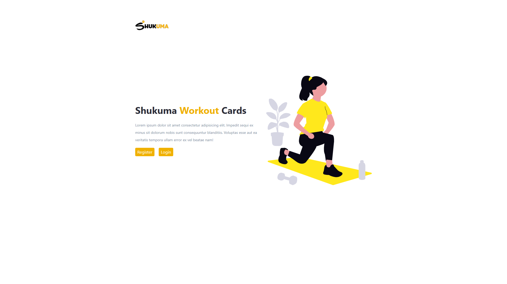
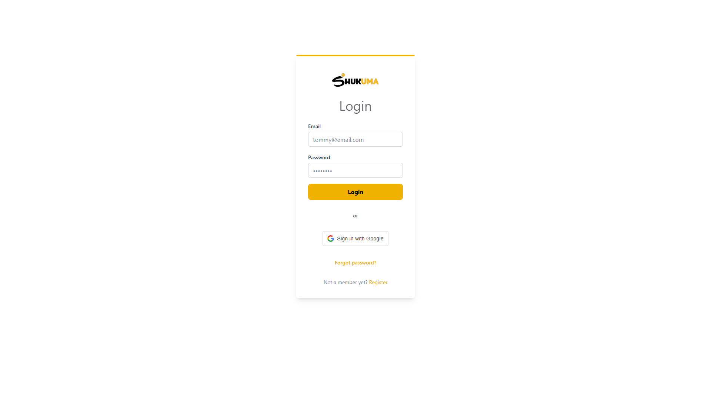
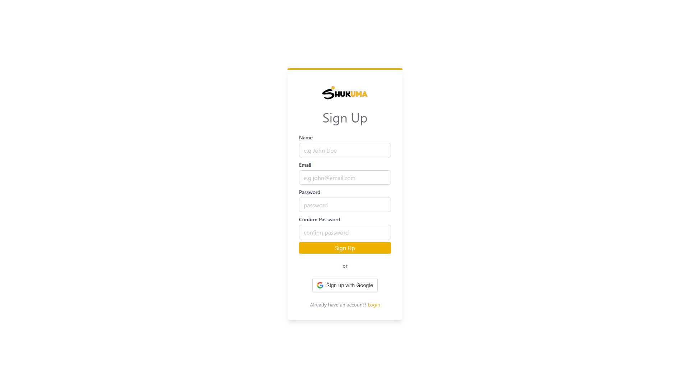
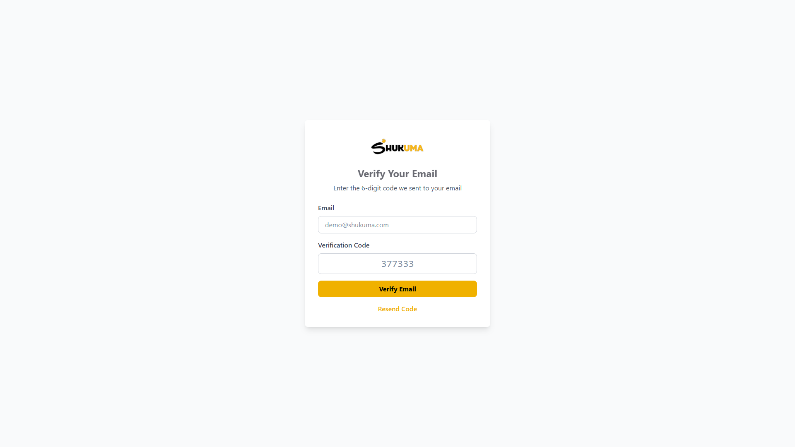
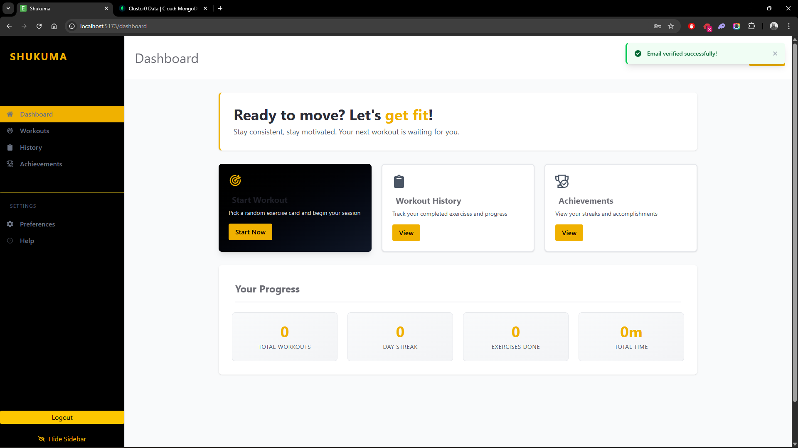
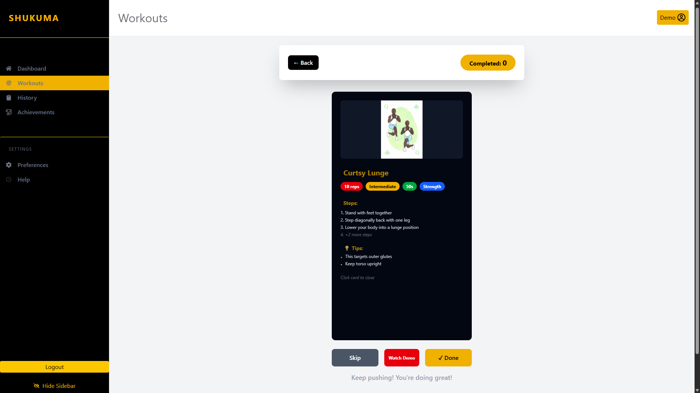
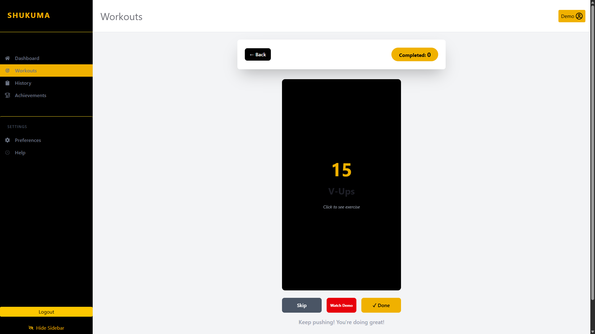
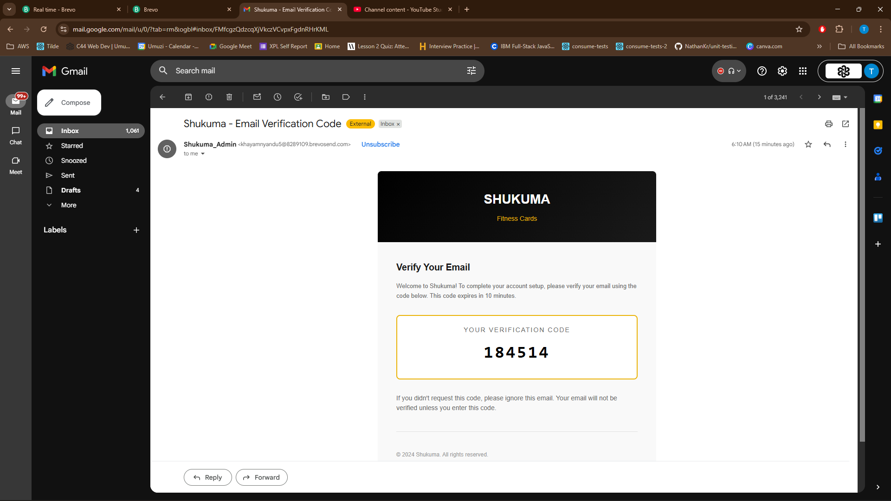
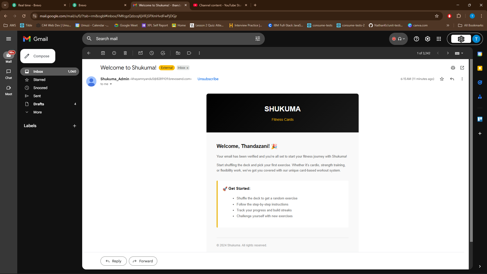

# Shukuma - Fitness Exercise Card App

A modern web application that converts physical exercise cards into a digital workout experience with card-based exercise selection, progress tracking, and enhanced authentication.

## Live Demo & Videos

**Live Website:** [https://shukuma-app-client.onrender.com](https://shukuma-app-client.onrender.com)

**Demo Video:** [Watch Demo](https://youtu.be/-wR23ylhqC0)

---

## Features

### Core MVP Features
- **Randomized Workout Cards** - Shuffle deck and get random exercises
- **Clear Instructions & Visuals** - Step-by-step guides with exercise images
- **Card Flip Interaction** - Front shows exercise name, back shows detailed instructions
- **Workout Logging** - Track completed exercises with timestamps
- **Progress Tracking** - View stats, streaks, and workout history
- **Video Demos** - Click to watch demonstration of each exercise
- **Responsive Design** - Works on desktop and mobile devices

### Authentication 
- **Email Registration with OTP** - Verify emails with 6-digit codes
- **Google OAuth Integration** - One-click sign-in with Google
- **Email Verification** - Users must verify email before accessing app
- **JWT Tokens** - Secure stateless authentication
- **Auto-verified Google Users** - No OTP needed for Google sign-ups

---

## Authentication System (Detailed)

### Why Custom Authentication?

The current Shukuma website currently allows fake emails like `example@wmail.com`. **I spent significant time building a real authentication system** to solve this:

### How It Works

**1. Email Registration Flow:**
```
User Signs Up
    ↓
Brevo Sends 6-Digit OTP Code
    ↓
User Enters Code (10-min expiry)
    ↓
Email Verified
    ↓
Access Dashboard
    ↓
Welcome email
```

**2. Google OAuth Flow:**
```
User Clicks "Sign In with Google"
    ↓
Google Verifies Account
    ↓
User Auto-Verified (emailVerified: true)
    ↓
Direct Access to Dashboard
```

```

### Security Features
- Passwords hashed with bcrypt
- JWT tokens with 7-day expiry
- OTP codes expire after 10 minutes
- Cannot login without verified email
- Google emails auto-verified (trusted provider)

```

## Important: Testing Authentication

When testing email verification, **Brevo takes 5-10 minutes to deliver emails**. 

**Steps:**
1. Register with any email
2. Wait 5-10 minutes for verification code
3. Check spam folder if not in inbox
4. Enter code to verify
5. Access dashboard

Verified demo credentials:
- Email: `demo@shukuma.com`
- Password: `Demo123!`

---

## 📸 Screenshots

### Landing Page

- Hero section with app description
- Quick sign-up/login options
- Navigation to demo features

### Login Page

- Email & password form
- Google OAuth button
- Sign up link

### Register Page

- Full name, email, password fields
- Google OAuth option
- Already have account link

### Email Verification

- Email input field
- 6-digit code entry
- Resend code button
- Note about Brevo delay

### Dashboard

- Welcome greeting
- Quick action cards (Start Workout, History, Achievements)
- Real-time stats (Total Workouts, Streak, Exercises Done, Total Time)
- Motivational section

### Workout Page

- Exercise card with flip animation
- Front: Exercise name & reps
- Back: Instructions, tips, badges
- Watch Demo button
- Skip/Done buttons
- Completed counter

### Flipped Card (Back)

- Exercise image
- Step-by-step instructions
- Tips section
- Category badges (Reps, Difficulty, Duration, Category)
- Video demo button


### Verify Code Email



### Welcome email


## Future Enhancements

- Mobile app (React Native)
- Social features (share progress, challenge friends)
- Nutrition tracking
- Advanced analytics dashboard
- Community challenges
- Gamification (badges, leaderboards)
- More OAuth providers (Facebook, Apple)
- User preferences
- etc


